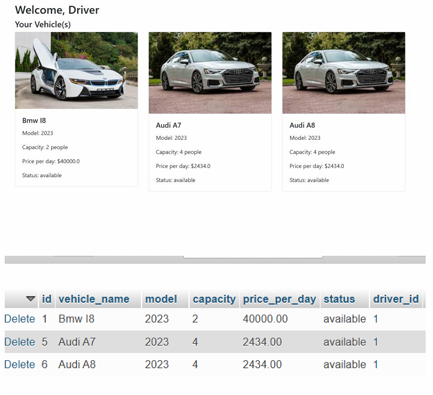
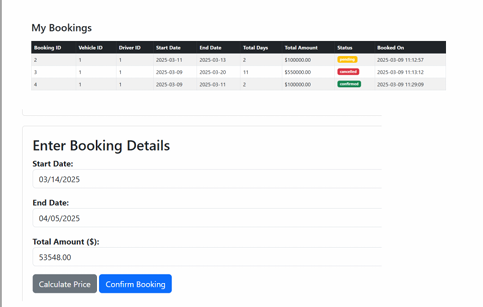
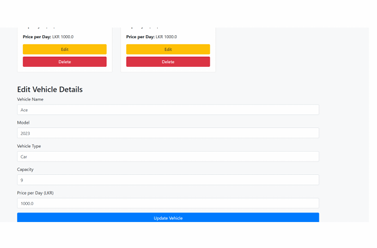

# 🚖 MegaCityCab Booking System

A Java-based cab booking and management system designed to streamline and digitize the operations of **Mega City Cab**, a leading taxi service in Colombo City.

---

## 📘 Overview

Thousands of customers rely on Mega City Cab every month. This project replaces the existing manual process with a computerized system that allows the company to manage bookings, customer details, car and driver information, billing, and more efficiently.

---

## ✨ Key Features

- **🔐 Login System:**
  - Secure user authentication using username and password.
  
- **📝 Customer Booking Management:**
  - Register new customers with details like name, address, NIC, etc.
  - Record new bookings with destination and contact info.

- **📋 View Booking Details:**
  - Display customer orders and booking records.

- **💳 Billing System:**
  - Calculate total amount including taxes/discounts.
  - Print customer bills based on booking number.

- **🚗 Vehicle & Driver Management:**
  - Maintain and manage car and driver information.

- **🧭 Help Section:**
  - Provide usage instructions and system guidelines.

- **🚪 Exit Mechanism:**
  - Proper system exit and logout functionality.

---

## 🛠️ Tech Stack

| Category    | Technology       |
|-------------|------------------|
| Language    | Java             |
| Database    | MySQL            |
| Tools       | IntelliJ IDEA    |
| Principles  | SOLID, OOP       |
| Testing     | JUnit, Manual QA |

---

## 🧱 Software Architecture

The system is built following **SOLID principles** for maintainable, scalable code:

- **S**ingle Responsibility: Each class handles one responsibility.
- **O**pen/Closed: Classes are open for extension, closed for modification.
- **L**iskov Substitution: Replaceable subtypes used safely in parent contexts.
- **I**nterface Segregation: Small, focused interfaces for specific behavior.
- **D**ependency Inversion: High-level modules depend on abstractions.

The project uses a clean **MVC architecture** to separate concerns:
- **Model** – Business logic and data
- **View** – User interface (Java Swing)
- **Controller** – Application flow and input handling

---

## Image Screenshot

<table>
  <tr>
    <td></td>
    <td></td>
    <td></td>
  </tr>
</table>

